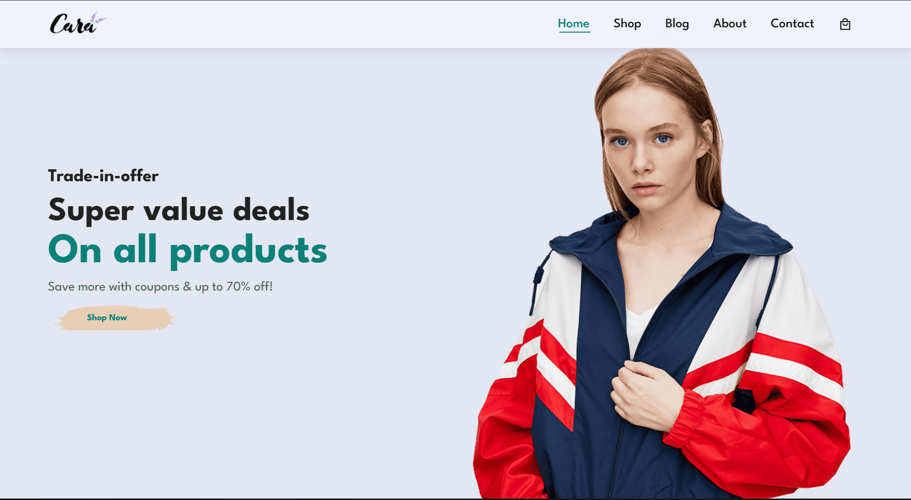

# 🛍️ Cara - E-commerce Platform

<div align="center">

[](https://opensource.org/licenses/MIT)
[](https://developer.mozilla.org/en-US/docs/Web/HTML)
[](https://developer.mozilla.org/en-US/docs/Web/CSS)
[](https://developer.mozilla.org/en-US/docs/Web/JavaScript)
[](CONTRIBUTING.md)

**A modern, responsive e-commerce platform built with vanilla HTML, CSS, and JavaScript**

[Live Demo](#) · [Report Bug](https://github.com/janavipandole/Cara/issues) · [Request Feature](https://github.com/janavipandole/Cara/issues)

</div>

---

## 📋 Table of Contents

- [About The Project](#-about-the-project)
- [Features](#-features)
- [Tech Stack](#-tech-stack)
- [Getting Started](#-getting-started)
- [Project Structure](#-project-structure)
- [Screenshots](#-screenshots)
- [Roadmap](#-roadmap)
- [Contributing](#-contributing)
- [License](#-license)
- [Contact](#-contact)
- [Acknowledgments](#-acknowledgments)

---

## 🎯 About The Project

Cara is a fully responsive e-commerce website that provides users with a seamless online shopping experience. Built with modern web technologies, it features an intuitive interface for browsing products, managing shopping carts, and exploring product details. The platform is designed to be fast, accessible, and easy to use across all devices.

### Why Cara?

- ✨ **Clean & Modern UI** - Beautiful, intuitive interface with smooth animations
- 📱 **Fully Responsive** - Optimized for mobile, tablet, and desktop devices
- ⚡ **Fast & Lightweight** - Built with vanilla JavaScript for optimal performance
- 🎨 **Customizable** - Easy to modify and extend for your needs
- 🆓 **Open Source** - Free to use and contribute to

---

## ✨ Features

### 🛒 Shopping Experience
- Browse products by categories
- View detailed product information
- Add/remove items from shopping cart
- Quantity adjustment in cart
- Dynamic cart total calculation

### 📄 Multiple Pages
- **Home** - Featured products and promotions
- **Shop** - Complete product catalog
- **Product Details** - Individual product pages with descriptions
- **About** - Company information and mission
- **Blog** - Latest news and articles
- **Contact** - Get in touch form
- **Cart** - Shopping cart management

### 🎨 Design Features
- Modern and clean interface
- Smooth scrolling and animations
- Hover effects and transitions
- Mobile-first responsive design
- Cross-browser compatibility

### 🔧 Technical Features
- Semantic HTML5 markup
- CSS3 with Flexbox and Grid layouts
- Vanilla JavaScript 
- Modular and maintainable code structure

---

## 🛠️ Tech Stack

- **Frontend**: HTML5, CSS3, JavaScript (ES6+)
- **Styling**: Custom CSS 
- **Icons**: Font Awesome / Custom SVGs
- **Version Control**: Git & GitHub

---

## 🚀 Getting Started

### Prerequisites

All you need is a modern web browser and a text editor!

### Installation

1. **Clone the repository**
   ```bash
   git clone https://github.com/janavipandole/Cara.git
   cd Cara
   ```

2. **Open in browser**
   
   Simply open `index.html` in your web browser:
   - Double-click the `index.html` file, or
   - Right-click and select "Open with" your preferred browser, or
   - Use a local development server:
   
   ```bash
   # Using Python 3
   python -m http.server 8000
   
   # Using Node.js (with http-server package)
   npx http-server
   
   # Using PHP
   php -S localhost:8000
   ```

3. **Access the site**
   
   Open your browser and navigate to `http://localhost:8000`

### Development

For live reloading during development, you can use:

- [Live Server](https://marketplace.visualstudio.com/items?itemName=ritwickdey.LiveServer) (VS Code Extension)
- [Browser Sync](https://browsersync.io/)
- [Live Reload](http://livereload.com/)

---

## 📁 Project Structure

```bash
Cara/
├── images/                  # Image assets
│   ├── about/              # About page images
│   ├── banner/             # Banner images
│   ├── blog/               # Blog images
│   ├── feature/            # Feature icons
│   ├── pay/                # Payment method images
│   ├── people/             # Team member images
│   ├── products/           # Product images
│   └── logo.png            # Site logo
├── about.html              # About page
├── blog.html               # Blog listing page
├── cart.html               # Shopping cart page
├── contact.html            # Contact page
├── index.html              # Homepage
├── shop.html               # Product listing page
├── singleProduct.html      # Product detail page
├── app.js                  # Main JavaScript file
├── style.css               # Main stylesheet
├── LICENSE                 # MIT License
├── README.md               # This file
└── CONTRIBUTING.md         # Contribution guidelines
```

---

## 📸 Screenshots


```markdown
### Homepage


### Shop


### Shopping Cart

```

---

## 🗺️ Roadmap

### Current Version (v1.0)
- [x] Responsive homepage design
- [x] Product listing pages
- [x] Shopping cart functionality
- [x] Product detail pages
- [x] About and contact pages
- [x] Blog section

### Upcoming Features
- [ ] **Product Search** - Search functionality with filters
- [ ] **User Authentication** - Login and registration
- [ ] **Product Filters** - Filter by category, price, rating
- [ ] **Wishlist** - Save favorite products
- [ ] **Product Reviews** - Customer ratings and reviews
- [ ] **Order Tracking** - Track order status
- [ ] **Dark Mode** - Theme toggle functionality
- [ ] **Multi-language Support** - Internationalization
- [ ] **Backend Integration** - Connect to API/database
- [ ] **Payment Gateway** - Integrate payment processing
- [ ] **Admin Panel** - Product management system

See the [open issues](https://github.com/janavipandole/Cara/issues) for a full list of proposed features and known issues.

---

## 🤝 Contributing

Contributions are what make the open-source community such an amazing place to learn, inspire, and create. Any contributions you make are **greatly appreciated**.

Please read our [Contributing Guidelines](CONTRIBUTING.md) before submitting a Pull Request.

### How to Contribute

1. **Fork the Project**
2. **Create your Feature Branch**
   ```bash
   git checkout -b feature/AmazingFeature
   ```
3. **Commit your Changes**
   ```bash
   git commit -m 'Add some AmazingFeature'
   ```
4. **Push to the Branch**
   ```bash
   git push origin feature/AmazingFeature
   ```
5. **Open a Pull Request**

### Ways to Contribute
- 🐛 Report bugs and issues
- 💡 Suggest new features or enhancements
- 📝 Improve documentation
- 🎨 Enhance UI/UX design
- ✅ Write tests
- 🔧 Fix bugs and implement features

---

## 📄 License

This project is licensed under the MIT License - see the [LICENSE](LICENSE) file for details.

---

## 👤 Contact

**Janavi Pandole**

- GitHub: [@janavipandole](https://github.com/janavipandole)
- Project Link: [https://github.com/janavipandole/Cara](https://github.com/janavipandole/Cara)

---

## 🙏 Acknowledgments

- [Font Awesome](https://fontawesome.com) - Icons
- All contributors who help improve this project

---

## ⭐ Show Your Support

If you find this project helpful, please consider giving it a ⭐ on GitHub!

---

<div align="center">

**[Back to Top](#-cara---e-commerce-platform)**

Made with ❤️ by [Janavi Pandole](https://github.com/janavipandole)

</div>
